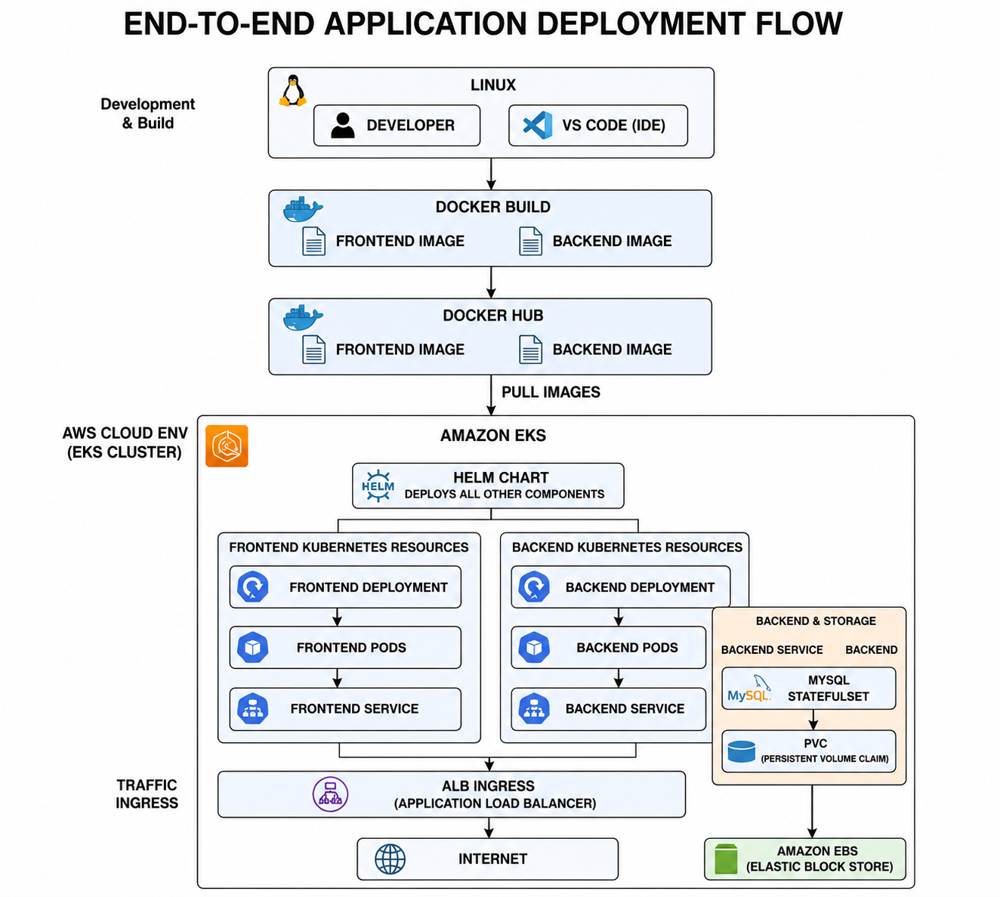

# Production-Style 3-Tier Application Deployment on AWS EKS

A production-style 3-tier application deployed on Amazon EKS using Kubernetes, Helm, Docker, Docker Hub, AWS ALB Ingress, MySQL StatefulSet, and persistent storage.

## Architecture



## Technologies Used

- Amazon EKS
- Kubernetes
- Helm
- Docker
- Docker Hub
- AWS Application Load Balancer (ALB) Ingress
- MySQL
- Kubernetes StatefulSet
- Persistent Volume Claim (PVC)
- Amazon EBS
- Linux

## Project Structure

```text
Production-Style-3-Tier-Application-Deployment-on-AWS-EKS/
│
├── backend/
│   ├── Dockerfile
│   ├── package.json
│   └── server.js
│
├── frontend/
│   ├── Dockerfile
│   └── index.html
│
├── helm/
│   ├── templates/
│   ├── Chart.yaml
│   ├── ingress.yaml
│   └── values.yaml
│
├── screenshots/
│   ├── application.png
│   ├── database.png
│   ├── docker-hub.png
│   └── eks.png
│
├── architecture-diagram.png
└── README.md
